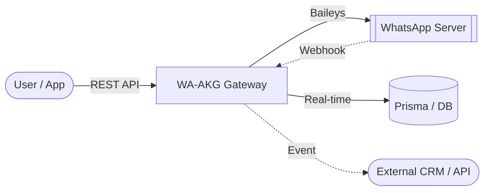

<div align="center">

# 🚀 WA-AKG: The Ultimate WhatsApp Gateway & Dashboard


**A professional, multi-session WhatsApp Gateway, Dashboard, and Automation System.**  
Built with Next.js 15 and Baileys for high-performance messaging automation.

> [!TIP]
> **Looking for the latest features?** Check out the [beta branch](https://github.com/mrifqidaffaaditya/WA-AKG/tree/beta) or our [pre-releases](https://github.com/mrifqidaffaaditya/WA-AKG/releases) for experimental sources.

[Features](#-features) • [User Guide](docs/USER_GUIDE.md) • [API Documentation](docs/API_DOCUMENTATION.md) • [Database Setup](docs/DATABASE_SETUP.md) • [Installation](#-installation)

</div>

---

## 📖 documentation

- **[Master Project Documentation](docs/PROJECT_DOCUMENTATION.md)**: Architecture, database, and logic flow.
- **[API Documentation](docs/API_DOCUMENTATION.md)**: Comprehensive guide for all **86 endpoints**.
- **[Environment Variables](docs/ENVIRONMENT_VARIABLES.md)**: Configuration and security guide.

---

## 🌟 Why WA-AKG?

WA-AKG transforms your WhatsApp into a fully programmable RESTful API. It's designed for scale, reliability, and ease of use, making it the perfect bridge between your business logic and WhatsApp's global reach.

### 🏗️ How it Works



### 🔥 Key Features

- **📱 Multi-Session Management**: Connect and manage unlimited accounts via QR code.
- **⚡ Pro WhatsApp Engine**: Powered by Baileys for high-speed, stable connections.
- **📅 Advanced Scheduler**: Precise message planning with global timezone support.
- **📢 Safe Broadcast**: Built-in anti-ban mechanisms with randomized delays (10-30s).
- **🤖 Smart Auto-Reply**: Keywords matching (`EXACT`, `CONTAINS`, `STARTS_WITH`) with media support.
- **🔗 Enterprise Webhooks**: Robust event forwarding for messages, connections, and group updates.
- **📇 Advanced Contacts**: Rich contact management with LID, verified names, and profile pictures.
- **🎨 Creative Tools**: Built-in Sticker Maker with background removal (remove.bg integration).

<details>
<summary>📂 <b>View Webhook Payload Example</b></summary>

```json
{
  "event": "message.received",
  "sessionId": "xgj7d9",
  "timestamp": "2026-01-17T05:33:08.545Z",
  "data": {
    "key": { "remoteJid": "6287748687946@s.whatsapp.net", "fromMe": false, "id": "3EB0B78..." },
    "from": "6287748687946@s.whatsapp.net",
    "sender": "100429287395370@lid",
    "remoteJidAlt": "100429287395370@lid",
    "type": "TEXT",
    "content": "saya sedang reply",
    "isGroup": false,
    "quoted": {
      "type": "IMAGE",
      "caption": "Ini caption dari reply",
      "fileUrl": "/media/xgj7d9-A54FD0B6F..."
    }
  }
}
```
</details>

---

## 🚀 Quick Installation

### 1. Prerequisites
- Node.js 20+
- PostgreSQL or MySQL
- Git

### 2. Setup
```bash
# Clone and install
git clone https://github.com/mrifqidaffaaditya/WA-AKG.git
cd WA-AKG
npm install

# Configure environment
cp .env.example .env
# Edit .env with your DATABASE_URL and AUTH_SECRET

# Push schema and create admin
npm run db:push
npm run make-admin admin@example.com password123
```

### 3. Run
```bash
# Development
npm run dev

# Production
npm run build && npm start
```

---

## 📚 API Reference Overview

WA-AKG provides a comprehensive REST API. Full details in [API_DOCUMENTATION.md](docs/API_DOCUMENTATION.md).

> [!TIP]
> Use the built-in **Swagger UI** for interactive exploration at `/docs`.

| Method | Endpoint | Description |
| :--- | :--- | :--- |
| `POST` | `/api/chat/send` | Send text, media, or stickers |
| `POST` | `/api/messages/broadcast` | Scalable bulk messaging |
| `PATCH` | `/api/sessions/{id}/settings` | Update session configuration |
| `GET` | `/api/groups` | List all available groups |
| `POST` | `/api/webhooks` | Register real-time event listeners |

### Example: Send Text Message
```bash
curl -X POST http://localhost:3000/api/chat/send \
  -H "X-API-Key: your_api_key" \
  -H "Content-Type: application/json" \
  -d '{
    "sessionId": "session_01",
    "jid": "62812345678@s.whatsapp.net",
    "message": { "text": "Hello from WA-AKG!" }
  }'
```

---

## ⚠️ Known Issues

> [!WARNING]
> **Status Update Feature (POST `/api/status/update`)**
> 
> The WhatsApp status/story update feature is currently **experiencing known issues** and should be avoided in production:
> - Text statuses with custom background colors may not display correctly
> - Media statuses (images/videos) may fail to upload to WhatsApp servers
> - The feature is under active development
> 
> We recommend waiting for the next release before using this endpoint in critical workflows.

---

## 🛡️ Security
- **API Key Auth**: Secured endpoints using `X-API-Key`.
- **RBAC**: Multi-role support (`SUPERADMIN`, `OWNER`, `STAFF`).
- **Encrypted Storage**: Sensitive credentials are secure.

---

<div align="center">
  Built with ❤️ by <a href="https://github.com/mrifqidaffaaditya">Aditya</a>  
  Licensed under <a href="LICENSE">MIT</a>
</div>
