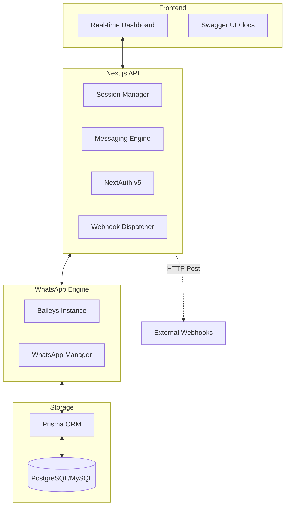

# 🏗️ WA-AKG Project Architecture & Logic

> **Version**: 1.1.2  
> **Last Updated**: January 2026  
> **Tech Stack**: Next.js 15 (App Router), TypeScript, Prisma, PostgreSQL/MySQL, Baileys, Tailwind CSS.

---

## 🏗️ System Architecture

WA-AKG is a decoupled system where the WhatsApp engine (Baileys) runs as a core service, integrated into a Next.js App Router environment.



---

## 📂 Directory Structure

```text
src/
├── app/                 # App Router Pages & API Routes
│   ├── api/             # 86 REST Endpoints
│   ├── dashboard/       # Protected Admin UI
│   └── auth/            # Auth logic (NextAuth)
├── components/          # Reusable UI (Shadcn)
├── lib/                 # Core utilities & DB connection
├── modules/             # Business logic
│   └── whatsapp/        # Baileys manager & instances
└── types/               # Global TS definitions
```

---

## 🗄️ Database Models (Prisma)

The system uses a relational schema optimized for multi-session messaging.

| Category | Models | Description |
| :--- | :--- | :--- |
| **Core** | `User`, `Session`, `AuthState` | Authentication and session lifecycle. |
| **Messaging** | `Message`, `Contact`, `Group` | Chat history and metadata sync. |
| **Automation** | `AutoReply`, `ScheduledMessage` | Automated logic and queues. |
| **Infrastructure** | `Webhook`, `Notification`, `Label` | Logs, tagging, and event forwarding. |

---

## ⚡ Key Logic Flows

### 1. Connection Lifecycle
When a user adds a session:
1. API creates a `Session` record in DB.
2. `WhatsAppManager` spawns a new Baileys instance.
3. QR code is generated and streamed via API.
4. Upon scan, credentials are encrypted and saved to `AuthState`.

### 2. Messaging & Webhooks
Every incoming message follows this path:
1. Baileys `messages.upsert` event triggers.
2. Logic enriches the data (resolves participant info, downloads media).
3. Record is saved to `Message` table.
4. Webhook Dispatcher identifies active webhooks for that session.
5. Payload is sent asynchronously to external URLs with retry logic.

---

## 🚀 Environment & Deployment

Configuration is centralized in `.env`. For production, ensure `NEXT_PUBLIC_SWAGGER_ENABLED` is set appropriately and `AUTH_SECRET` is strong.

> [!IMPORTANT]
> Always run `npm run db:push` after updates to ensure your schema matches the latest application version.

---
<div align="center">
  <small>Technical Reference for WA-AKG dev team.</small>
</div>
